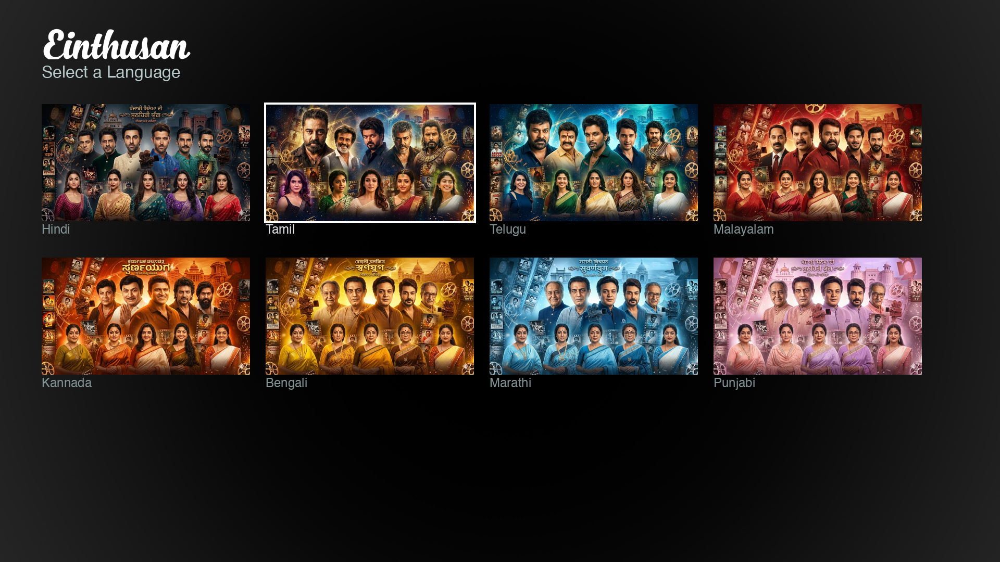
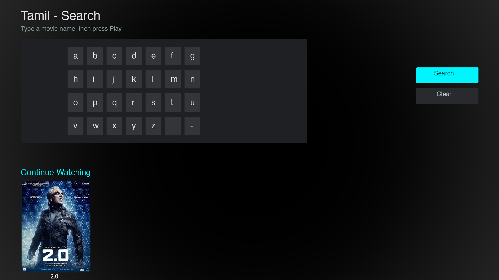
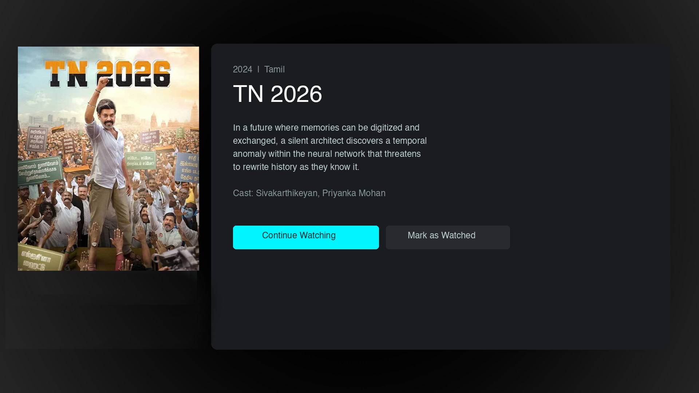
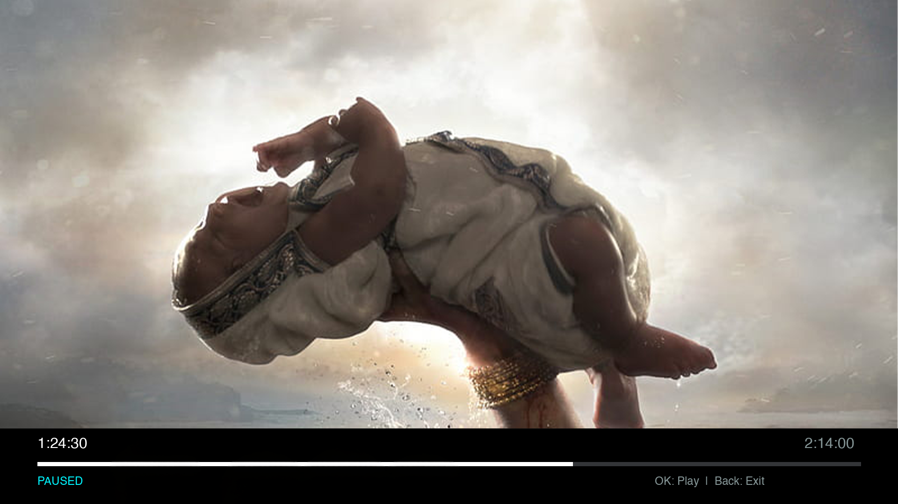

# Einthusan Roku Channel

A sideloaded Roku channel for streaming Indian movies from [Einthusan.tv](https://einthusan.tv). Supports 8 languages with search by title.


## Screenshots

| Home Screen | Search | Movie Details |
|:-----------:|:------:|:-------------:|
|  |  |  |

| Video Player | 
|:------------:|
| | 

## Features

- **8 Indian Languages** — Hindi, Tamil, Telugu, Malayalam, Kannada, Bengali, Marathi, Punjabi
- **Search** — Find movies by title within your selected language
- **Full Playback Controls** — Play/Pause (OK button), Fast-forward (+30s), Rewind (-15s), Back to exit
- **Auto-Authentication** — Proxy handles login via environment variables
- **Session Persistence** — No re-login needed between sessions

## Architecture

```
┌─────────────────┐         ┌──────────────────────┐          ┌──────────────────┐
│   Roku Device   │--HTTP-->│   Node.js Proxy      │--HTTPS-->│  einthusan.tv    │
│   (Channel)     │<--------│   (Docker on NAS)    │<---------│                  │
└─────────────────┘         └──────────────────────┘          └──────────────────┘
```

The Roku channel communicates with a Node.js proxy server running on your local network. The proxy handles authentication, HTML scraping, and stream URL extraction (including decryption of Einthusan's custom encoding).

## Requirements

- Roku device with [Developer Mode enabled](https://developer.roku.com/docs/developer-program/getting-started/developer-setup.md)
- A machine to run the proxy (NAS, Raspberry Pi, or any Docker host on your LAN) - This needs to be running all the time, so a NAS or a home server is preferred.
- Docker & Docker Compose
- Einthusan.tv Premium account

## Setup

### 1. Enable Developer Mode on Roku

1. On your Roku remote, press the following sequence: **Home 3x, Up 2x, Right, Left, Right, Left, Right**
2. A Developer Settings dialog will appear. Select **Enable installer and restart**
3. Set a developer password when prompted — note this down, you'll need it for deployment
4. After restart, your Roku will show a Developer Mode banner with its IP address
5. Verify by navigating to `http://ROKU_IP` in your browser — you should see the Development Application Installer page

### 2. Configure Environment

Create `proxy/.env`:

```env
PORT=3000
NAS_IP=192.168.1.XXX
EINTHUSAN_EMAIL=your-email@example.com
EINTHUSAN_PASSWORD=your-password
ROKU_IP=192.168.1.XXX
ROKU_DEV_PASSWORD=your-roku-dev-password
```

`NAS_IP` is the host running the proxy (your NAS/server). It's the single source of truth for the proxy address — `deploy.sh` injects `http://NAS_IP:PORT` into the channel at package time, so you don't edit any `.brs` files. `ROKU_IP` is your Roku device.

### 3. Start the Proxy

```bash
cd proxy
docker-compose up -d
```

Verify it's running:

```bash
curl http://$NAS_IP:3000/health
```

### 4. Deploy to Roku

Package and sideload the channel:

```bash
./deploy.sh
```

This script zips the `channel/` directory and uploads it to your Roku via the Development Application Installer. The channel will appear on your Roku home screen as a sideloaded "dev" app.

**Manual deployment** (if `deploy.sh` doesn't work):

1. Zip the contents of the `channel/` folder (not the folder itself — `manifest` should be at the zip root)
2. Open `http://ROKU_IP` in your browser
3. Log in with username `rokudev` and the developer password you set
4. Click "Upload" and select your zip file
5. Click "Install"

The channel will appear on your Roku home screen. Sideloaded apps persist through reboots but are replaced if you upload a new zip.

## Project Structure

```
├── channel/                    # Roku BrightScript/SceneGraph channel
│   ├── manifest                # Channel metadata
│   ├── source/
│   │   └── main.brs           # Entry point
│   ├── components/
│   │   ├── MainScene.*        # Screen navigation & routing
│   │   ├── HomeScreen.*       # Language selection grid
│   │   ├── SearchScreen.*     # Search keyboard & results
│   │   ├── MovieDetail.*      # Movie info & play button
│   │   ├── VideoPlayer.*      # Video playback with controls
│   │   ├── MovieGrid.*        # Movie poster grid
│   │   ├── MoviePoster.*      # Grid item component
│   │   ├── LanguageTile.*     # Language card component
│   │   ├── ActionButton.*     # Custom styled button
│   │   └── HttpTask.*         # Network request task node
│   └── images/
│       ├── logo.png           # Einthusan wordmark
│       ├── background.jpg     # Perforated metal background
│       ├── focus_border.png   # Grid focus indicator
│       └── languages/         # Language tile images (400x225 PNG)
│
├── proxy/                      # Node.js proxy server
│   ├── server.js              # Express routes & auto-login
│   ├── auth.js                # Login flow & session management
│   ├── scraper.js             # Catalog & search HTML parsing
│   ├── stream.js              # Stream URL extraction & decryption
│   ├── Dockerfile
│   ├── docker-compose.yml
│   └── package.json
│
└── deploy.sh                   # One-command Roku deployment
```

## Proxy API

| Endpoint | Description |
|----------|-------------|
| `GET /health` | Server status & auth check |
| `GET /catalog/:lang` | Browse movies by language |
| `GET /search?lang=X&q=Y` | Search movies |
| `GET /meta/:id` | Movie details (poster, synopsis, cast) |
| `GET /stream/:id` | Get stream URLs (MP4/HLS) |


## Controls

| Remote Button | Action |
|---------------|--------|
| D-pad | Navigate menus & grids |
| OK | Select item / Toggle play-pause |
| Play/Pause | Submit search / Toggle play-pause |
| Fast Forward / Right | Skip forward 30s |
| Rewind / Left | Skip back 15s |
| Back | Go to previous screen / Stop playback |

## Support

If you find this project useful, consider buying me a coffee!

[](https://buymeacoffee.com/sridharj)

## Disclaimer

This project is for **personal, private use only**. It is designed to be sideloaded on a single Roku device for accessing content from an account you own. It is not intended for redistribution or commercial use. Respect Einthusan.tv's terms of service.

## License

MIT